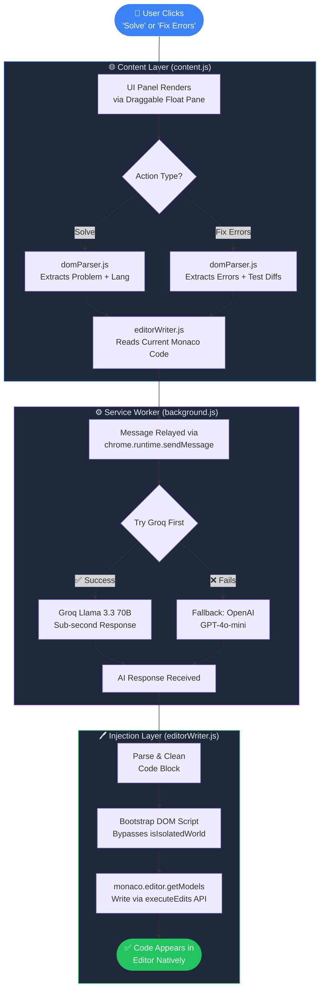

<div align="center">

<br/>

<pre align="center">
 █████╗ ███████╗██╗  ██╗     ██████╗██████╗ ████████╗
██╔══██╗██╔════╝██║ ██╔╝    ██╔════╝██╔══██╗╚══██╔══╝
███████║███████╗█████╔╝     ██║     ██████╔╝   ██║   
██╔══██║╚════██║██╔═██╗     ██║     ██╔═══╝    ██║   
██║  ██║███████║██║  ██╗    ╚██████╗██║        ██║   
╚═╝  ╚═╝╚══════╝╚═╝  ╚═╝    ╚═════╝╚═╝        ╚═╝   
</pre>

### ⚡ The Ultimate AI Coding Assistant for LeetCode

<br/>

[](.)
[](LICENSE)
[](.)
[](.)
[](.)

<br/>

> **Ask CPT**— Ask Code Problem Transformer is a production-grade Chrome Extension that silently reads your LeetCode context, analyzes your failing test cases, and fixes your code — all in under a second. Powered by Groq's Llama 3.3 70B with OpenAI GPT-4o-mini fallback and OpenRouter support.

<br/>

</div>

---

## 📋 Table of Contents

- [✨ Features](#-features)
- [🧩 System Architecture](#-system-architecture)
- [⚙️ Architecture Diagram](#️-architecture-diagram)
- [🚀 How It Works](#-how-it-works)
- [🔄 Error Fix Flow](#-error-fix-flow)
- [🛠️ Installation](#️-installation)
- [🔑 Getting API Keys](#-getting-api-keys)
- [📖 Usage Guide](#-usage-guide)
- [🔧 Configuration](#-configuration)
- [🔐 Security Design](#-security-design)
- [📁 Project Structure](#-project-structure)
- [🤝 Contributing](#-contributing)
- [📜 License](#-license)
- [⭐ Support](#-support)

---

## ✨ Features

<table>
<tr>
<td width="50%">

### ⚡ Ultra-Fast Generation
Powered by **Groq's Llama 3.3 70B** model, Ask CPT delivers sub-second code generation. OpenAI GPT-4o-mini serves as an automatic fallback so you're never left waiting.

</td>
<td width="50%">

### 🧠 Multi-Model AI Fallback System
If the primary model fails or slows down, Ask CPT automatically switches to backup models:
- Groq Llama 3.3 70B
- GPT-4o-mini
- OpenRouter & other compatible LLM APIs

This guarantees **reliable code generation without interruptions**.

</td>
</tr>
<tr>
<td width="50%">

### 🎓 Assessment Mode Ready
Fully compatible with **standard problems, mock assessments, interview paths, timed assessments, explore pages,** and dynamic SPA routes. The UI injects universally across every `leetcode.com` sub-route.

</td>
<td width="50%">

### 🛡️ SPA Invincibility Module
LeetCode uses React-based SPA routing, which normally breaks browser extensions. Ask CPT's SPA-safe injection system survives dynamic route changes, editor reloads, fullscreen mode, and layout updates — no refresh required.

</td>
</tr>
<tr>
<td width="50%">

### 🔍 Blind Reading DOM Engine
Multi-layered problem scraper with intelligent fallbacks — automatically falls back through multiple extraction strategies:
1. Standard DOM selectors
2. Keyword anchor search (`Example 1`, `Constraints`)
3. Full visible text scan

This ensures the AI **always understands the problem context**.

</td>
<td width="50%">

### 🐛 Deep Test Case Error Scanner
When your code fails tests, Ask CPT automatically scans the LeetCode console (`data-e2e-locator="console-result"`). It extracts input arrays, expected vs actual output, runtime exceptions, and stack traces — then feeds that directly to the AI for **precise bug fixing**.

</td>
</tr>
<tr>
<td width="50%">

### 🤖 Smart Auto-Fix Engine
Instead of generating random new solutions, Ask CPT:
1. Reads your current code
2. Identifies the failure
3. Mutates the logic intelligently
4. Produces a corrected version

This dramatically improves fix accuracy.

</td>
<td width="50%">

### 🎭 Native Monaco Editor Injection
Injects code directly into **Monaco Editor's global instance** via a DOM bootstrapped script, bypassing Chrome's `isIsolatedWorld` restrictions. Generated code is inserted **exactly as if you typed it yourself**.

</td>
</tr>
<tr>
<td width="50%">

### 🎛️ Draggable Floating UI
A lightweight floating control panel that is movable, non-blocking, always visible, and high z-index safe — it never obstructs your view.

</td>
<td width="50%">

### 🔐 CSP / CORS Bypass
All API calls are securely relayed through a Manifest V3 Service Worker, intentionally bypassing stringent content security policies placed by LeetCode — keeping your tokens safe and off the page.

</td>
</tr>
</table>

---

## 🧩 System Architecture

Below is the simplified linear architecture of Ask CPT:

```
        ┌──────────────────────┐
        │  LeetCode Web Page   │
        │ (React SPA Platform) │
        └───────────┬──────────┘
                    │
                    ▼
        ┌──────────────────────┐
        │  Ask CPT Content     │
        │  Script Injection    │
        └───────────┬──────────┘
                    │
                    ▼
        ┌──────────────────────┐
        │   DOM Parser Engine  │
        │ (Problem Extraction) │
        └───────────┬──────────┘
                    │
                    ▼
        ┌──────────────────────┐
        │  Editor Context Read │
        │   Monaco Editor API  │
        └───────────┬──────────┘
                    │
                    ▼
        ┌──────────────────────┐
        │ Background Service   │
        │ (CORS Bypass Layer)  │
        └───────────┬──────────┘
                    │
                    ▼
        ┌──────────────────────┐
        │   AI Model Router    │
        │ Groq / OpenAI / LLM  │
        └───────────┬──────────┘
                    │
                    ▼
        ┌──────────────────────┐
        │ Generated Solution   │
        │   + Auto Fix Logic   │
        └───────────┬──────────┘
                    │
                    ▼
        ┌──────────────────────┐
        │ Monaco Editor Writer │
        │  (Code Injection)    │
        └──────────────────────┘
```

---

## ⚙️ Architecture Diagram

The following diagram illustrates how Ask CPT processes a user request end-to-end:



---

## 🚀 How It Works

```
┌─────────────────────────────────────────────────────────────────────┐
│                      ASK CPT EXECUTION FLOW                         │
├──────────────┬──────────────────────────────────────────────────────┤
│  STEP 1      │  You open any LeetCode problem or assessment page.    │
│  🔌 Inject   │  Ask CPT silently injects its floating panel UI.      │
├──────────────┼──────────────────────────────────────────────────────┤
│  STEP 2      │  domParser.js scrapes the full problem description,   │
│  🔍 Parse    │  constraints, examples, and your active language.     │
├──────────────┼──────────────────────────────────────────────────────┤
│  STEP 3      │  background.js relays the payload to Groq / OpenAI,  │
│  🤖 Generate │  bypassing LeetCode's strict CSP/CORS policies.       │
├──────────────┼──────────────────────────────────────────────────────┤
│  STEP 4      │  editorWriter.js bootstraps a DOM script to access   │
│  🖊️  Write   │  Monaco's global instance and injects the solution.   │
├──────────────┼──────────────────────────────────────────────────────┤
│  STEP 5      │  If tests fail, click "Fix Errors." The error scanner │
│  🐛 Fix      │  feeds diffs + exceptions back to the AI for a        │
│              │  targeted, mutation-based refix — not a blind retry.  │
└──────────────┴──────────────────────────────────────────────────────┘
```

### Core Architecture Components

- **Background Service Bypass (`background.js`):** API calls are securely relayed through a Manifest V3 Service Worker to intentionally bypass stringent content security policies (CORS/CSP) placed by LeetCode.
- **DOM Engine (`domParser.js`):** A highly redundant, multi-layered scraper tool that gracefully falls back through multiple extraction strategies to grab problems, tests, and raw error output.
- **Editor Wrapper (`editorWriter.js`):** Securely bypasses Chrome's `isIsolatedWorld` rules by bootstrapping a `<script>` directly onto the DOM, allowing Ask CPT to communicate laterally with LeetCode's proprietary variables.

---

## 🔄 Error Fix Flow

```
Run Code
   │
   ▼
Tests Fail
   │
   ▼
Ask CPT reads console (data-e2e-locator="console-result")
   │
   ▼
Extract input + expected vs actual + exception trace
   │
   ▼
Send to AI with previous code context
   │
   ▼
Generate targeted mutation fix
   │
   ▼
Inject corrected solution into Monaco Editor
```

---

## 🛠️ Installation

### Prerequisites
- Google Chrome (or any Chromium-based browser)
- A **Groq API Key** → [Get it free at console.groq.com](https://console.groq.com)
- *(Optional)* An **OpenAI API Key** for fallback → [platform.openai.com](https://platform.openai.com)

### Steps

```bash
# 1. Clone the repository
git clone https://github.com/your-username/ask-cpt-extension.git
cd ask-cpt-extension

# 2. Set up your config file
cp config.example.js config.js
```

> **⚠️ Important:** `config.js` is listed in `.gitignore`. **Never commit real API keys to GitHub.**

```bash
# 3. Open Chrome and navigate to:
chrome://extensions/

# 4. Enable "Developer mode" (toggle in the top-right corner)

# 5. Click "Load unpacked" and select the project folder
```

You should now see the **Ask CPT** extension icon in your Chrome toolbar. 🎉

---

## 🔑 Getting API Keys

### Groq API (Primary — Ultra Fast)

```
https://console.groq.com/keys
```

Recommended model:

```
llama-3.3-70b-versatile
```

### OpenAI API (Fallback)

```
https://platform.openai.com/api-keys
```

Recommended fallback model:

```
gpt-4o-mini
```

---

## 📖 Usage Guide

### 🟢 Solving a Problem

| Step | Action |
|------|--------|
| **1** | Navigate to any LeetCode problem (`leetcode.com/problems/...`) |
| **2** | The Ask CPT floating panel appears automatically |
| **3** | Select your preferred language from the LeetCode editor |
| **4** | Click **`⚡ Generate Solution`** in the Ask CPT panel |
| **5** | The AI-generated solution is injected directly into your editor |
| **6** | Click the LeetCode **Run** or **Submit** button to verify |

### 🔴 Fixing Failing Tests

| Step | Action |
|------|--------|
| **1** | Run your current code against LeetCode's test cases |
| **2** | When tests fail, **do not copy any errors manually** |
| **3** | Click **`🐛 Fix Errors`** in the Ask CPT panel |
| **4** | The scanner extracts test diffs + exception traces automatically |
| **5** | The AI mutates the previous solution with a targeted fix |
| **6** | The corrected code is injected back into your editor |

### 🎛️ Panel Controls

| Control | Description |
|---------|-------------|
| **Drag** | Click and drag the panel header to reposition anywhere on screen |
| **Language** | Auto-detected from your active Monaco editor tab |
| **Model Badge** | Shows whether Groq or OpenAI handled the last request |

---

## 🔧 Configuration

Edit `config.js` after copying from `config.example.js`:

```javascript
// config.js — DO NOT commit this file

const CONFIG = {
  GROQ_API_KEY: "gsk_your_groq_key_here",        // Primary LLM (ultra-fast)
  OPENAI_API_KEY: "sk-your_openai_key_here",      // Fallback LLM

  // Model settings
  GROQ_MODEL: "llama-3.3-70b-versatile",
  OPENAI_MODEL: "gpt-4o-mini",

  // UI settings
  DEFAULT_PANEL_POSITION: { x: 20, y: 20 },       // Initial float position
};
```

---

## 🔐 Security Design

Ask CPT protects API usage and key exposure by routing all requests through `background.js`.

This avoids:
- CORS restrictions
- CSP blocking by LeetCode
- Token exposure in page-level scripts

All communication between the content script and the AI APIs flows exclusively through the Manifest V3 Service Worker, keeping your credentials off the page entirely.

---

## 📁 Project Structure

```
ask-cpt-extension/
│
├── manifest.json              # Chrome Extension Manifest V3 config
├── background.js              # Service Worker — API relay + CSP bypass
│
├── content/
│   ├── content.js             # Main orchestration + UI injection
│   ├── domParser.js           # Multi-layer DOM scraper for problems & errors
│   ├── editorWriter.js        # Monaco editor native injection wrapper
│   └── ui.js                  # Floating draggable panel UI
│
├── services/
│   ├── aiRouter.js            # Multi-model fallback routing logic
│   ├── groqClient.js          # Groq API client
│   └── openaiClient.js        # OpenAI API client
│
├── utils/
│   ├── helpers.js             # Shared utility functions
│   └── logger.js              # Debug logging
│
├── config.example.js          # Template config (safe to commit)
├── config.js                  # ⚠️  Your real API keys (gitignored)
│
└── README.md
```

---

## 🤝 Contributing

Contributions, issues, and feature requests are warmly welcome!

You can contribute by:
- Improving DOM parsing strategies
- Adding new AI providers or models
- Optimizing performance or injection reliability
- Improving the floating UI / UX

**To contribute:**

1. **Fork** the repository
2. Create your feature branch: `git checkout -b feat/your-feature`
3. Commit your changes: `git commit -m 'feat: add your feature'`
4. Push to the branch: `git push origin feat/your-feature`
5. Open a **Pull Request**

Please follow [Conventional Commits](https://www.conventionalcommits.org/) for commit messages.

---

## 📜 License

This project is licensed under the **MIT License** — you are free to use, modify, and distribute this software. See the [LICENSE](LICENSE) file for details.

---

## ⭐ Support

If Ask CPT saved you time or helped you crack a tough problem:

- ⭐ **Star the repository**
- 🐛 **Report issues** via GitHub Issues
- 💡 **Suggest new features** via Discussions
- 🤝 **Open a Pull Request** to contribute

---

<div align="center">

Built with ⚡ by developers, for developers.

*If Ask CPT saved you time, consider giving it a ⭐ on GitHub!*

</div>
