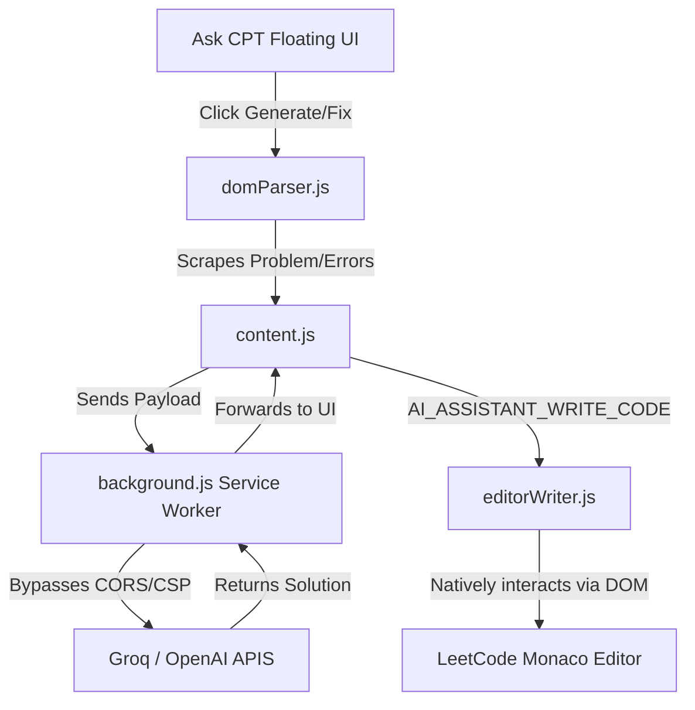

# 🚀 Ask CPT: Ultimate AI Coding Assistant

  
  
  

 

**Ask CPT** is a highly advanced, ultra-fast Chrome Extension designed to seamlessly solve algorithms and auto-fix your code on platforms like **LeetCode**. 

Powered by multiple fallback LLMs (Groq Llama 3.3, OpenAI GPT-4o-mini, OpenRouter), Ask CPT reads your active code editor context, analyzes test case exceptions, and dynamically fixes logic bugs instantly.

---

## ✨ Features

- **⚡ Ultra-Fast Generation:** Powered primarily by the **Groq Llama 3.3 70B** model for near-instant (sub-second) code generation.
- **🎓 LeetCode Assessment Mode Support:** Fully compatible with standard problems, mock assessments, interview paths, and dynamic exploration screens. The Assistant's visual UI injects universally across every `leetcode.com` sub-route.
- **🛡️ Invincibility Module (SPA Safe):** Works flawlessly inside Single Page Applications (SPA), surviving React dynamic routing, full-screen modes, and multi-pane layout shifts without reloading.
- **🔍 "Blind Reading" DOM Engine:** Can parse abstract and randomized webpage formats. If standard LeetCode description tags fail or random layouts appear (like in timed assessments), the engine falls back to advanced anchor tracking or ultimately ingests visible DOM text to guarantee the AI understands the problem context.
- **🤖 Deep Test Case Error Scanner:** When tests fail, you do not have to copy and paste the console errors. The extension searches deep within LeetCode's bottom test console locator (`data-e2e-locator="console-result"`) to extract exact Expected vs Actual diffs, Input arrays, and Exception traces to securely feed the AI.
- **🐛 Smart Auto-Fix:** Auto-reads your editor's active code context natively using the Monaco engine. If tests fail, clicking "Fix Errors" forces the AI to mutate its previous suggestion instead of blindly returning identical broken code.
- **🎭 Native Injection:** Asynchronously injects content scripts and types dynamically into the `monaco.editor` global instances as if you were coding it yourself.
- **🎛️ Movable UI Layout:** High z-index draggable interactive floating pane that never obstructs your view.

---

## 🛠️ Installation

1. **Clone or download** this repository.
2. Rename the configuration file from `config.example.js` to `config.js`.
3. **Add your API Keys:** Open `config.js` and input your keys (Groq, OpenAI, etc.). 
   > ⚠️ **Note:** `config.js` is intentionally added to `.gitignore`. Do NOT expose your real keys to GitHub.
4. Open Chrome and navigate to `chrome://extensions/`
5. Turn on **Developer mode** in the top right.
6. Click **Load unpacked** and select the folder encompassing this project.
7. Navigate to a LeetCode problem or assessment page and let Ask CPT handle the heavy lifting!

---

## 💻 How to Use

1. **Open LeetCode:** Navigate to any problem or mock assessment on LeetCode. You will see the **Ask CPT floating pane** appear.
2. **Move the Pane:** You can click and drag the header of the AI assistant pane to move it anywhere on your screen so it never blocks your view.
3. **Generate a Solution:** Click `"Generate Solution"`. Ask CPT will secretly read the problem, detect your selected programming language, and instantly inject the optimal code directly into your editor.
4. **Run Your Code:** Click the LeetCode `Run` or `Submit` button.
5. **Auto-Fix Errors:** If your code encounters a `SyntaxError`, `Wrong Answer`, or `Time Limit Exceeded`, simply click `"Fix Errors"`. Ask CPT will completely read the error trace from the console and repair your code natively!

---

## ⚙️ How it Works under the Hood

Ask CPT is designed to bypass standard browser restrictions and cleanly interact with proprietary DOM structures. Here is the data flow:

### Core Architecture Components
- **Background Service Bypass (`background.js`):** API calls are securely relayed through a Manifest V3 Service Worker `background.js` to intentionally bypass stringent content security policies (CORS/CSP) placed by LeetCode.
- **DOM Engine (`domParser.js`):** A highly redundant, multi-layered scraper tool that gracefully falls back through multiple extraction strategies to grab problems, tests, and raw error output.
- **Editor Wrapper (`editorWriter.js`):** Securely bypasses Chrome's `isIsolatedWorld` rules by bootstrapping a `<script>` directly onto the DOM, allowing Ask CPT to communicate laterally with LeetCode's proprietary variables.

---

## 🤝 Contribution
Contributions, issues, and feature requests are highly welcome!

## 📜 License
This project is licensed under the MIT License - see the [LICENSE](LICENSE) file for details.
